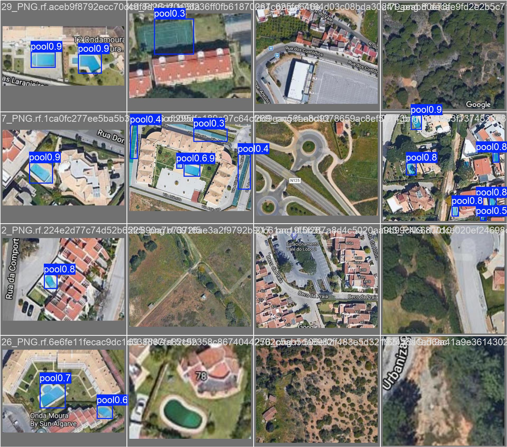

# Pool Detection in Aerial Imagery — YOLO26

Fine-tuned YOLO26 object detectors that localize swimming pools in overhead aerial imagery, with a
systematic model-size comparison (n / s / m), an architecture comparison (RF-DETR, oriented-box OBB variants),
and a GroundingDINO-assisted auto-labeling loop.



## Results

YOLO26 models fine-tuned via transfer learning at 768 px input (Ultralytics, early stopping from 100 epochs),
evaluated on a held-out split. RF-DETR (Nano/Small) and YOLO26-OBB variants were also trained for architecture
comparison (see notebook); the quantified table below covers the YOLO26 axis-aligned models:

| Model | mAP@50 | mAP@50-95 | Precision | Recall | Epochs |
|---|---|---|---|---|---|
| **YOLO26m** | **0.80** | **0.50** | **0.99** | **0.77** | 77 |
| YOLO26s | 0.77 | 0.49 | 0.86 | 0.73 | 58 |
| YOLO26n | 0.72 | 0.49 | 0.78 | 0.73 | 39 |

Per-model training curves, PR curves and confusion matrices are in [`results/`](results/)
(e.g. [YOLO26m PR curve](results/yolo26m_768/BoxPR_curve.png), [training curves](results/yolo26m_768/results.png)).

## Data

Self-curated single-class (`pool`) aerial-imagery dataset, annotated and hosted on Roboflow:
[detecting-swimming-pools v1](https://universe.roboflow.com/vladmateis-workspace/detecting-swimming-pools/dataset/1) (CC BY 4.0),
train/valid/test splits; source tiles 288 px (rescaled to 768 px at training time). Initial annotation drafted with
GroundingDINO zero-shot detection and manually reviewed; training data extended via model-assisted auto-labeling
(~1,400 additional images), pseudo-labels reviewed before merging. No additional offline augmentation was applied.
Images are not committed to this repo — pull the dataset from Roboflow and point `data.yaml` at it.

## Approach

1. GroundingDINO zero-shot pre-annotation, manual review and correction on Roboflow; YOLO-format export.
2. Model-assisted auto-labeling loop on unlabeled imagery to grow the training set.
3. Transfer-learning fine-tuning of YOLO26 n/s/m from pretrained weights (768 px input, batch 8-16, early stopping);
   RF-DETR Nano/Small and YOLO26/YOLO11 OBB variants trained for architecture comparison.
4. Held-out evaluation and model-size trade-off analysis: YOLO26m buys +8 mAP@50 points over n at ~8x the parameter count.

## Reproduce

```bash
pip install -r requirements.txt
# notebook: full pipeline (data prep -> auto-labeling -> training -> evaluation)
jupyter lab notebooks/Pool_detection_full_pipeline.ipynb
# or train directly:
yolo detect train data=data.yaml model=yolo26m.pt imgsz=768 epochs=100
```

## Repo structure

```
notebooks/   full pipeline notebook
results/     per-model training metrics, curves, confusion matrices
examples/    sample predictions on validation imagery
data.yaml    dataset config (single class: pool)
```

Trained weights (`best.pt`) are published as a GitHub Release asset rather than committed.
